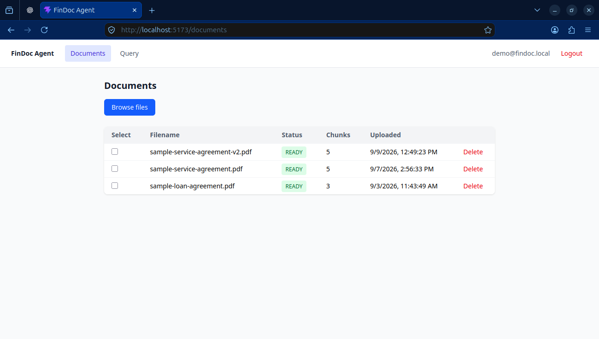
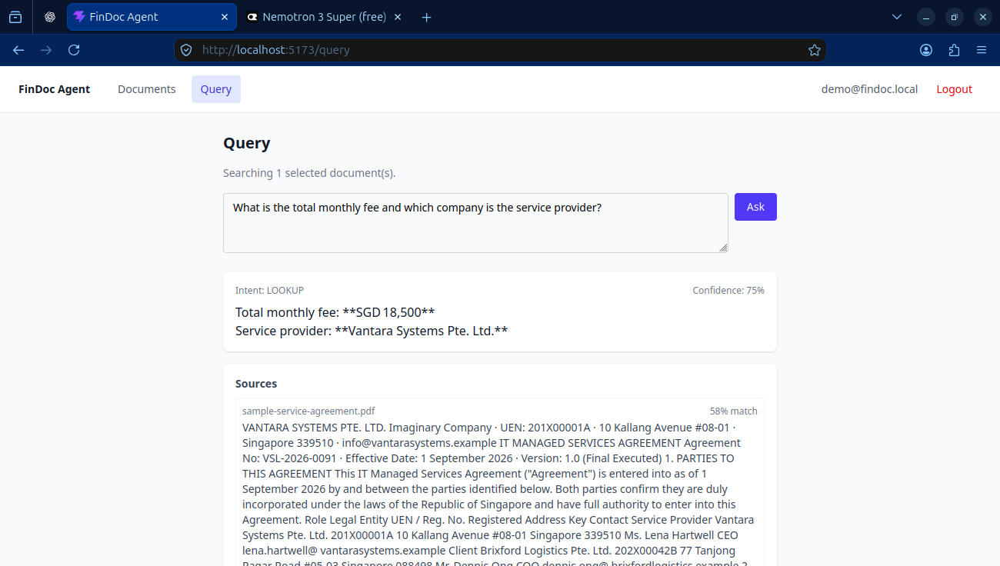

# FinDocAgent

FinDocAgent is a tenant-aware agentic RAG backend for ingesting financial documents, retrieving relevant content, and producing grounded responses with source citations. It is built with Spring Boot, PostgreSQL with pgvector, Apache Kafka, and pluggable LLM providers.

## Features

- JWT-based authentication that carries `tenant_id` and `user_id`, with tenant-scoped persistence and request tracing.
- PDF and text document upload, source-file storage, status tracking, original-file download, soft deletion, and a 20 MB servlet multipart limit.
- Kafka-backed ingestion with PDF/text extraction, retry tracking, and dead-letter topic routing.
- Content chunking at 512 tokens with a 50-token overlap, including page metadata for PDF sources.
- Gemini embeddings and pgvector cosine-similarity retrieval with tenant and document filters.
- Bounded agent queries with intent classification, a five-iteration maximum, structured citations, session history, and stage-level query traces.
- Document comparison that retrieves evidence independently for each requested document.
- Gemini embeddings and OpenRouter generation with response validation, circuit-breaker settings, and fallback behavior.
- Liquibase-managed database migrations, seeded local demo data, and file-based request logging with trace context.
- Basic React frontend with login, document upload/status management, and session-aware agent queries.

## Product Screenshots

The frontend provides a focused workflow for uploading financial documents, monitoring ingestion, selecting source documents, and asking grounded questions with citations.

### Document Management

Upload documents, track processing status and chunk counts, and manage the tenant's document library from one view.



### Grounded Document Querying

Ask questions against selected documents and review the generated answer, detected intent, confidence, and source evidence together.



## Requirements

| Software | Required version or setup |
| --- | --- |
| Java | 17 |
| Gradle | Wrapper 8.10.2, included in the repository |
| Spring Boot | 3.2.12 |
| Node.js and npm | Required for the frontend in `findoc-agent/frontend/`; use a current LTS release |
| PostgreSQL | A local instance with the pgvector extension, listening on `localhost:5432` |
| Apache Kafka | A local broker listening on `localhost:9092` |
| Podman | Needed to run the Testcontainers-based integration test task |

The default database is `findoc` on `localhost:5432`. PostgreSQL and Kafka must be available before starting the full local workflow.

## Local Setup

1. Create a local PostgreSQL database named `findoc` with the pgvector extension available, and start Kafka on port `9092`.
2. From the Gradle project directory, create the local configuration file from the tracked template:

	```bash
	cd findoc-agent
	cp .env.example .env
	```

3. Set `JWT_SECRET` in `.env` to a unique value of at least 32 characters. Update the database and Kafka settings when your local services do not use the defaults.
4. Start the backend application:

	```bash
	./gradlew bootRun --console=plain
	```

The service listens on `http://localhost:8080`. Confirm it is available with:

```bash
curl -i http://localhost:8080/actuator/health
```

`/actuator/health` and `/api/v1/auth/token` are public. Other API routes require a bearer token.

5. In a second terminal, start the frontend:

	```bash
	cd findoc-agent/frontend
	cp .env.example .env
	npm ci
	npm run dev
	```

The frontend listens on `http://localhost:5173`. Set `VITE_API_BASE_URL` in `frontend/.env` when the backend uses a different address. The backend allows this origin by default; configure `FINDOC_CORS_ALLOWED_ORIGINS` in the backend `.env` when using another frontend origin.

## Configuration

Copy only [findoc-agent/.env.example](findoc-agent/.env.example) to a local `.env`; the local file is ignored by Git. Gradle loads `.env` for `bootRun`, `test`, and `integrationTest`. Values already provided by the shell, CI system, or deployment environment take precedence.

| Group | Variables | Purpose |
| --- | --- | --- |
| Required locally | `DB_USERNAME`, `DB_PASSWORD`, `KAFKA_BOOTSTRAP_SERVERS`, `JWT_SECRET` | Database access, Kafka connectivity, and token signing |
| Gemini | `GEMINI_API_KEY`, `GEMINI_EMBEDDING_MODEL`, `GEMINI_BASE_URL` | Embedding provider configuration |
| OpenRouter | `OPENROUTER_API_KEY`, `OPENROUTER_MODEL`, `OPENROUTER_BASE_URL` | Generation provider configuration |
| Provider resilience | `GEMINI_CIRCUIT_FAILURE_THRESHOLD`, `GEMINI_CIRCUIT_OPEN_DURATION_SECONDS`, `OPENROUTER_CIRCUIT_FAILURE_THRESHOLD`, `OPENROUTER_CIRCUIT_OPEN_DURATION_SECONDS` | Circuit-breaker thresholds and open durations |
| Ingestion storage | `INGESTION_UPLOAD_DIR` | Temporary source-file storage directory |
| Kafka ingestion | `FINDOC_INGESTION_TOPIC`, `FINDOC_INGESTION_GROUP`, `FINDOC_INGESTION_DLQ`, `FINDOC_INGESTION_RETRY_INITIAL_INTERVAL_MS`, `FINDOC_INGESTION_RETRY_MULTIPLIER`, `FINDOC_INGESTION_RETRY_MAX_INTERVAL_MS`, `FINDOC_INGESTION_RETRY_MAX_RETRIES` | Ingestion topics and retry/backoff settings |
| Backend CORS | `FINDOC_CORS_ALLOWED_ORIGINS` | Comma-separated browser origins allowed to call `/api/**`; defaults to `http://localhost:5173` |
| Logging | `LOG_PATH`, `LOG_FILE` | Local file logging destination and filename |

The frontend has its own non-secret configuration file at `findoc-agent/frontend/.env`:

| Variable | Purpose |
| --- | --- |
| `VITE_API_BASE_URL` | Backend base URL used by the browser; defaults to `http://localhost:8080` in the tracked template |

Provider keys are optional for startup but required for live provider-backed embedding and generation validation. Do not commit `.env` or use it as a source of deployment secrets; use injected environment variables or the platform secret manager instead.

## Common Commands

Run these commands from `findoc-agent/`:

```bash
./gradlew compileJava --console=plain
./gradlew test --console=plain
./gradlew integrationTest --console=plain
./gradlew bootRun --console=plain
```

`test` runs the unit test suite and excludes integration tests. `integrationTest` uses Testcontainers for PostgreSQL and Kafka, so it requires an accessible Podman socket. API authentication and request examples are available in [docs/dev-guide/api-examples.sh](docs/dev-guide/api-examples.sh).

Frontend checks run from `findoc-agent/frontend/`:

```bash
npm run build
npm run lint
```

The current frontend scope includes login, document upload/list/status polling/delete, document selection, and session-aware querying. Session history, document comparison, and query explanation remain backend API workflows without dedicated frontend screens.

## Local Demo Data

Liquibase applies the schema migrations and seeds a local demo account:

| Field | Value |
| --- | --- |
| Tenant ID | `00000000-0000-0000-0000-000000000001` |
| Username | `demo@findoc.local` |
| Password | `demo123` |

Use this account only for local development. See the [developer guide](docs/dev-guide/README.md) for the request walkthrough and implementation notes.

## Development Status

The application’s core document, retrieval, and agent flows are implemented. Live PostgreSQL/pgvector, Kafka, Gemini, and OpenRouter validation remains an environment-dependent checkpoint. The current implementation status and handoffs are tracked in [docs/implementation-status.md](docs/implementation-status.md).
