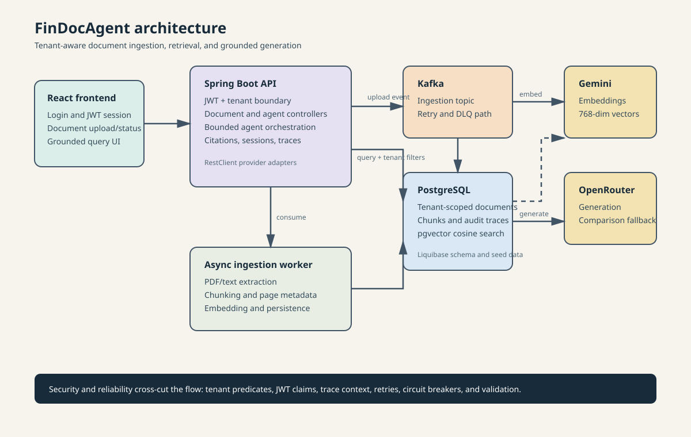

# FinDocAgent

FinDocAgent is a tenant-aware agentic RAG backend for ingesting financial documents, retrieving relevant content, and producing grounded responses with source citations. It is built with Spring Boot, PostgreSQL with pgvector, Apache Kafka, and pluggable LLM providers.

## Features

The feature set is deliberately shaped around the lifecycle of a financial document rather than a generic chatbot demo:

- **Secure tenancy first:** JWTs carry `tenant_id` and `user_id`, and those claims flow into request tracing and every persistence query. This demonstrates the isolation boundary that a multi-customer document product needs.
- **Durable document intake:** PDF and text uploads are stored with status tracking, original-file download, soft deletion, and a 20 MB limit. The source remains auditable even while asynchronous processing is still running.
- **Asynchronous ingestion:** Kafka separates the upload request from extraction and indexing. Retry tracking and a dead-letter topic make failed processing observable and recoverable instead of blocking the API request.
- **Retrieval-ready content:** Documents are chunked into 512-token sections with 50-token overlap and page metadata. The overlap preserves context at boundaries while page data keeps citations useful to a reviewer.
- **Tenant-safe semantic search:** Gemini embeddings and PostgreSQL/pgvector cosine retrieval filter by tenant and selected documents. This keeps relevance useful without weakening authorization.
- **Bounded agent behavior:** Intent classification, a five-iteration ceiling, session history, structured citations, and stage-level traces make the agent inspectable and operationally bounded.
- **Evidence-based comparison:** Comparison retrieves evidence independently for each requested document, reducing the risk that one document silently dominates the result.
- **Provider resilience:** Gemini handles embeddings while OpenRouter handles generation, with response validation, circuit breakers, and local fallback behavior for generation failures. Provider responsibilities stay explicit and replaceable.
- **Operational foundations:** Liquibase migrations, seeded local demo data, request logging with trace context, and a small React workflow make the system demonstrable from upload through grounded answer.

## Architecture

The diagram below shows the main request and data paths, including where the tenant boundary is enforced and where asynchronous processing begins.



The editable diagram source and a short explanation of the design decisions are in [docs/story-012-architecture-and-portfolio-positioning.md](docs/story-012-architecture-and-portfolio-positioning.md).

## Why I Built This

I built FinDocAgent as a portfolio project targeted at Singapore's financial-services market. The domain is a useful test of production-minded document intelligence: financial teams need to find answers in regulated documents, retain evidence for review, and keep customer data isolated when the same platform serves multiple organizations.

That target shaped the architecture. The project treats multi-tenancy, auditability, asynchronous ingestion, source citations, provider failure, and bounded agent behavior as first-class concerns rather than polishing them after a chatbot prototype works. It is intended to show how an AI feature can fit into the controls, operational expectations, and document-heavy workflows common to Singapore fintech, banking, insurance, and compliance products.

## Product Screenshots

The frontend provides a focused workflow for uploading financial documents, monitoring ingestion, selecting source documents, and asking grounded questions with citations.

### Document Management

Upload documents, track processing status and chunk counts, and manage the tenant's document library from one view.


### Grounded Document Querying

Ask questions against selected documents and review the generated answer, detected intent, confidence, and source evidence together.


## Requirements

| Software | Required version or setup |
| --- | --- |
| Java | 17 |
| Gradle | Wrapper 8.10.2, included in the repository |
| Spring Boot | 3.2.12 |
| Node.js and npm | Required for the frontend in `findoc-agent/frontend/`; use a current LTS release |
| PostgreSQL | A local instance with the pgvector extension, listening on `localhost:5432` |
| Apache Kafka | A local broker listening on `localhost:9092` |
| Podman | Needed to run the Testcontainers-based integration test task |

The default database is `findoc` on `localhost:5432`. PostgreSQL and Kafka must be available before starting the full local workflow.

## Local Setup

1. Create a local PostgreSQL database named `findoc` with the pgvector extension available, and start Kafka on port `9092`.
2. From the Gradle project directory, create the local configuration file from the tracked template:

	```bash
	cd findoc-agent
	cp .env.example .env
	```

3. Set `JWT_SECRET` in `.env` to a unique value of at least 32 characters. Update the database and Kafka settings when your local services do not use the defaults.
4. Start the backend application:

	```bash
	./gradlew bootRun --console=plain
	```

The service listens on `http://localhost:8080`. Confirm it is available with:

```bash
curl -i http://localhost:8080/actuator/health
```

`/actuator/health` and `/api/v1/auth/token` are public. Other API routes require a bearer token.

5. In a second terminal, start the frontend:

	```bash
	cd findoc-agent/frontend
	cp .env.example .env
	npm ci
	npm run dev
	```

The frontend listens on `http://localhost:5173`. Set `VITE_API_BASE_URL` in `frontend/.env` when the backend uses a different address. The backend allows this origin by default; configure `FINDOC_CORS_ALLOWED_ORIGINS` in the backend `.env` when using another frontend origin.

## Configuration

Copy only [findoc-agent/.env.example](findoc-agent/.env.example) to a local `.env`; the local file is ignored by Git. Gradle loads `.env` for `bootRun`, `test`, and `integrationTest`. Values already provided by the shell, CI system, or deployment environment take precedence.

| Group | Variables | Purpose |
| --- | --- | --- |
| Required locally | `DB_USERNAME`, `DB_PASSWORD`, `KAFKA_BOOTSTRAP_SERVERS`, `JWT_SECRET` | Database access, Kafka connectivity, and token signing |
| Gemini | `GEMINI_API_KEY`, `GEMINI_EMBEDDING_MODEL`, `GEMINI_BASE_URL` | Embedding provider configuration |
| OpenRouter | `OPENROUTER_API_KEY`, `OPENROUTER_MODEL`, `OPENROUTER_BASE_URL` | Generation provider configuration |
| Provider resilience | `GEMINI_CIRCUIT_FAILURE_THRESHOLD`, `GEMINI_CIRCUIT_OPEN_DURATION_SECONDS`, `OPENROUTER_CIRCUIT_FAILURE_THRESHOLD`, `OPENROUTER_CIRCUIT_OPEN_DURATION_SECONDS` | Circuit-breaker thresholds and open durations |
| Ingestion storage | `INGESTION_UPLOAD_DIR` | Temporary source-file storage directory |
| Kafka ingestion | `FINDOC_INGESTION_TOPIC`, `FINDOC_INGESTION_GROUP`, `FINDOC_INGESTION_DLQ`, `FINDOC_INGESTION_RETRY_INITIAL_INTERVAL_MS`, `FINDOC_INGESTION_RETRY_MULTIPLIER`, `FINDOC_INGESTION_RETRY_MAX_INTERVAL_MS`, `FINDOC_INGESTION_RETRY_MAX_RETRIES` | Ingestion topics and retry/backoff settings |
| Backend CORS | `FINDOC_CORS_ALLOWED_ORIGINS` | Comma-separated browser origins allowed to call `/api/**`; defaults to `http://localhost:5173` |
| Logging | `LOG_PATH`, `LOG_FILE` | Local file logging destination and filename |

The frontend has its own non-secret configuration file at `findoc-agent/frontend/.env`:

| Variable | Purpose |
| --- | --- |
| `VITE_API_BASE_URL` | Backend base URL used by the browser; defaults to `http://localhost:8080` in the tracked template |

Provider keys are optional for startup but required for live provider-backed embedding and generation validation. Do not commit `.env` or use it as a source of deployment secrets; use injected environment variables or the platform secret manager instead.

## Common Commands

Run these commands from `findoc-agent/`:

```bash
./gradlew compileJava --console=plain
./gradlew test --console=plain
./gradlew integrationTest --console=plain
./gradlew bootRun --console=plain
```

`test` runs the unit test suite and excludes integration tests. `integrationTest` uses Testcontainers for PostgreSQL and Kafka, so it requires an accessible Podman socket. API authentication and request examples are available in [docs/dev-guide/api-examples.sh](docs/dev-guide/api-examples.sh).

Frontend checks run from `findoc-agent/frontend/`:

```bash
npm run build
npm run lint
```

The current frontend scope includes login, document upload/list/status polling/delete, document selection, and session-aware querying. Session history, document comparison, and query explanation remain backend API workflows without dedicated frontend screens.

## Local Demo Data

Liquibase applies the schema migrations and seeds a local demo account:

| Field | Value |
| --- | --- |
| Tenant ID | `00000000-0000-0000-0000-000000000001` |
| Username | `demo@findoc.local` |
| Password | `demo123` |

Use this account only for local development. See the [developer guide](docs/dev-guide/README.md) for the request walkthrough and implementation notes.

## Development Status

FinDocAgent is an implemented, locally validated end-to-end system rather than a prototype. The backend supports tenant-isolated JWT authentication, durable document uploads, Kafka ingestion with retry/DLQ handling, PDF and text extraction, chunking, Gemini embeddings, pgvector cosine retrieval, bounded agent workflows, session-aware generation, citations, explain traces, document comparison, and provider fallback resilience. The React frontend covers login, upload and document status management, document selection, and grounded session-aware querying.

The automated coverage includes controller contracts, OpenAPI metadata, provider failure paths, tenant isolation, soft deletion, BYTEA-backed source storage, Kafka publication and consumption, ingestion readiness, native `<=>` retrieval, and live Gemini/OpenRouter interactions. The full unit suite and local integration suite pass against PostgreSQL/pgvector and Kafka.
