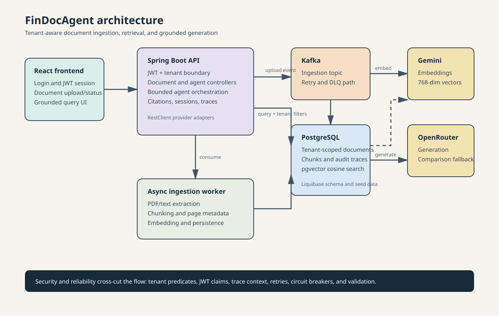
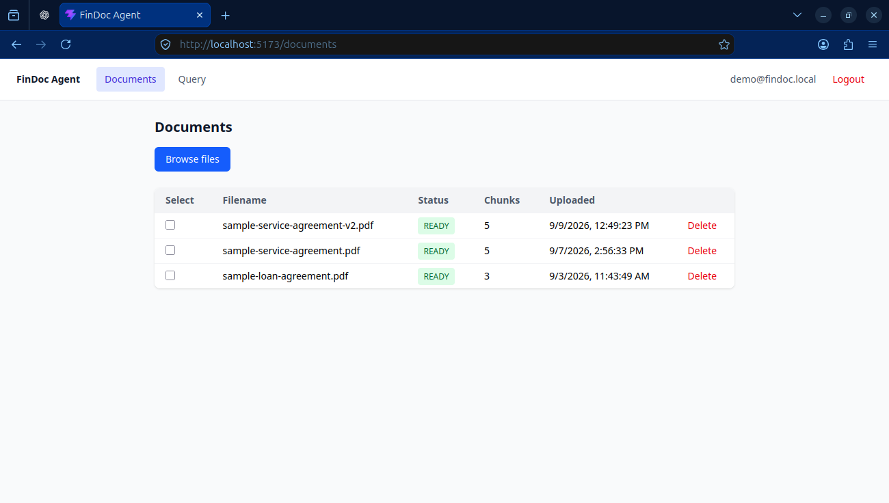
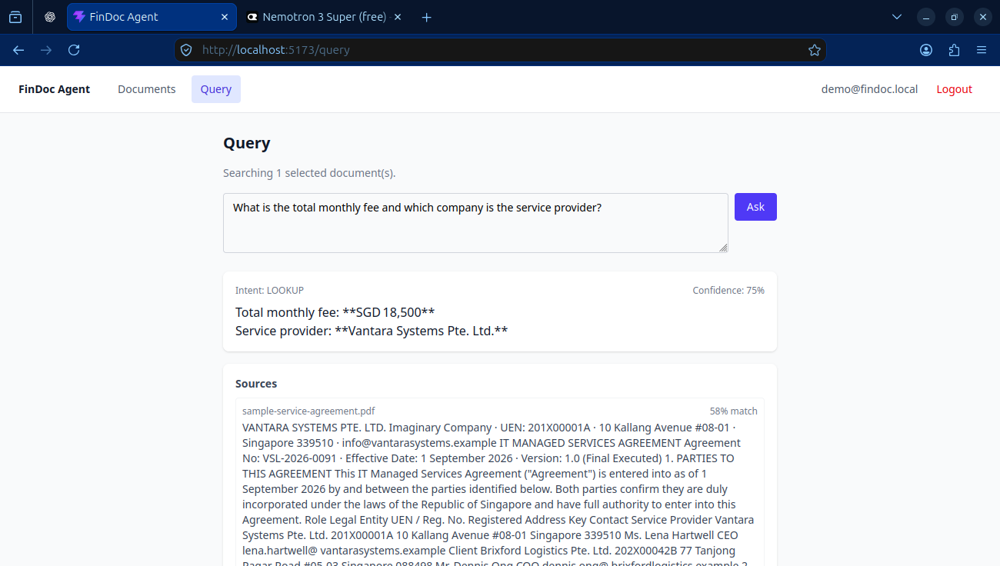

# FinDocAgent

FinDocAgent is a tenant-aware agentic RAG backend for ingesting financial documents, retrieving relevant content, and producing grounded responses with source citations. It is built with Spring Boot, PostgreSQL with pgvector, Apache Kafka, and pluggable LLM providers.

## Features

The feature set is deliberately shaped around the lifecycle of a financial document rather than a generic chatbot demo:

- **Secure tenancy first:** JWTs carry `tenant_id` and `user_id`, and those claims flow into request tracing and every persistence query. This demonstrates the isolation boundary that a multi-customer document product needs.
- **Durable document intake:** PDF and text uploads are stored with status tracking, original-file download, soft deletion, and a 20 MB limit. The source remains auditable even while asynchronous processing is still running.
- **Asynchronous ingestion:** Kafka separates the upload request from extraction and indexing. Retry tracking and a dead-letter topic make failed processing observable and recoverable instead of blocking the API request.
- **Retrieval-ready content:** Documents are chunked into 512-token sections with 50-token overlap and page metadata. The overlap preserves context at boundaries while page data keeps citations useful to a reviewer.
- **Tenant-safe semantic search:** Gemini embeddings and PostgreSQL/pgvector cosine retrieval filter by tenant and selected documents, returning five sources by default. This keeps relevance useful without weakening authorization.
- **Bounded agent behavior:** Intent classification, a five-iteration ceiling, session history, structured citations, and stage-level traces make the agent inspectable and operationally bounded.
- **Evidence-based comparison:** Comparison retrieves evidence independently for each requested document, reducing the risk that one document silently dominates the result.
- **Provider resilience:** Gemini handles embeddings while OpenRouter handles generation, with response validation, circuit breakers, and local fallback behavior for generation failures. Provider responsibilities stay explicit and replaceable.
- **Operational foundations:** Liquibase migrations, seeded local demo data, request logging with trace context, generated OpenAPI documentation with Swagger UI, and a small React workflow make the system demonstrable from upload through grounded answer.

## Architecture

The diagram below shows the main request and data paths, including where the tenant boundary is enforced and where asynchronous processing begins.

The editable diagram source and a short explanation of the design decisions are in [docs/story-012-architecture-and-portfolio-positioning.md](docs/story-012-architecture-and-portfolio-positioning.md).

## Why I Built This

I built FinDocAgent as a portfolio project targeted at Singapore's financial-services market. The domain is a useful test of production-minded document intelligence: financial teams need to find answers in regulated documents, retain evidence for review, and keep customer data isolated when the same platform serves multiple organizations.

That target shaped the architecture. The project treats multi-tenancy, auditability, asynchronous ingestion, source citations, provider failure, and bounded agent behavior as first-class concerns rather than polishing them after a chatbot prototype works. It is intended to show how an AI feature can fit into the controls, operational expectations, and document-heavy workflows common to Singapore fintech, banking, insurance, and compliance products.

## Product Screenshots

The frontend provides a focused workflow for uploading financial documents, monitoring ingestion, selecting source documents, and asking grounded questions with citations.

### Document Management

Upload documents, track processing status and chunk counts, and manage the tenant's document library from one view.

### Grounded Document Querying

Ask questions against selected documents and review the generated answer, detected intent, confidence, and source evidence together.

### Query 2: Traceable Retrieval and Explainability

The second demonstrated query asks: **“What are the response and resolution times for a P1 critical incident versus a P4 low priority incident?”** It shows the same grounded workflow with a different business question and makes the audit trail visible to a reviewer.

The query is executed through the backend in five visible stages:

1. **classify_intent:** The system identifies what kind of question is being asked.
2. **vector_search:** It finds the most relevant passages in the selected documents while respecting the user's document access.
3. **generate_report:** It uses those passages and the current conversation context to produce a grounded answer with source citations.
4. **Persist the conversation:** The question and answer are saved so the session can continue naturally.
5. **Persist the trace:** The system records the intent, confidence, timings, and stage results so the answer can be reviewed later.

The Recent Queries page shows the user's latest questions in one place. Selecting **Explain** opens the recorded `classify_intent`, `vector_search`, and `generate_report` stages, including their timings and a concise view of what each stage received and produced. This gives reviewers a practical explanation of how the answer was formed without exposing internal implementation details.

### Full Project Demo

Watch the [FinDocAgent demo recording](screens/FinDocAgentDemo.webm) for an overview of the document-intelligence workflow, from managing source documents to reviewing grounded answers and their supporting trace.

## Developer Runbook

For prerequisites, local backend and frontend setup, configuration, public endpoints, OpenAPI/Swagger access, demo credentials, and validation commands, see the [developer runbook](findoc-agent/README.md).

## Development Status

FinDocAgent is an implemented, locally validated end-to-end system rather than a prototype. The backend supports tenant-isolated JWT authentication, durable document uploads, Kafka ingestion with retry/DLQ handling, PDF and text extraction, chunking, Gemini embeddings, pgvector cosine retrieval, bounded agent workflows, session-aware generation, citations, explain traces, document comparison, and provider fallback resilience. The React frontend covers login, upload and document status management, document selection, and grounded session-aware querying.
