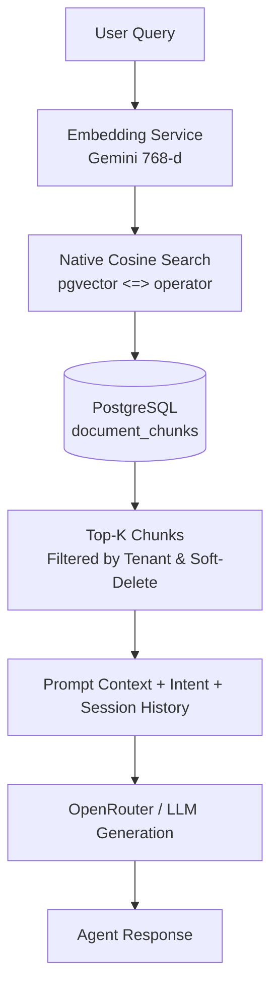

# Vector Search Architecture & Retrieval Strategy

This document outlines the evaluation of PostgreSQL with `pgvector` for production vector search, compares it with standalone vector databases (such as Chroma, Qdrant, and Pinecone), and details the vector retrieval strategy implemented in **FinDoc Agent**.

---

## 1. Vector Search Evaluation: PostgreSQL + `pgvector` in Production

### Is PostgreSQL + `pgvector` Good for Production?
**Yes.** PostgreSQL with the `pgvector` extension is widely adopted and highly performant in enterprise production environments.

#### Key Advantages:
* **Unified Database & Single Source of Truth:** Relational data (users, tenants, document metadata, audit traces) and vector embeddings reside in the exact same database. This eliminates dual-write synchronization and consistency issues between a primary database and an external vector engine.
* **ACID Compliance & Multi-Tenant Data Isolation:** PostgreSQL executes metadata filters (`tenant_id = :tenantId AND deleted_at IS NULL AND document_id IN (...)`) natively during or before distance calculation. This guarantees zero cross-tenant data leakage under strict security boundaries.
* **Operational Simplicity:** Leverage existing Postgres infrastructure for backups, high availability, point-in-time recovery, Liquibase migrations, and monitoring rather than managing a separate vector database cluster.
* **Scalability & Indexing:** With `HNSW` (Hierarchical Navigable Small World) or `IVFFlat` indexes, `pgvector` easily scales to millions of vectors with sub-50ms query latencies.

### Comparison: `pgvector` vs. Chroma vs. Dedicated Vector DBs

| Feature / Criteria | PostgreSQL (`pgvector`) | Chroma DB | Dedicated Vector DBs (Qdrant, Pinecone, Milvus) |
| :--- | :--- | :--- | :--- |
| **Primary Focus** | Relational DB + Vector Extension | Light-weight AI prototyping | Pure large-scale vector search |
| **Data Consistency** | Full ACID transactions | Eventual / File-based | Varies (mostly eventual/KV) |
| **Multi-Tenancy & Metadata** | Built-in via SQL (`WHERE tenant_id = ...`) | Basic metadata dict filtering | Metadata payload filtering |
| **Ecosystem & Scaffolding** | Java / Spring Data JPA, SQL, Liquibase | Python / JS SDKs | REST / gRPC SDKs |
| **Best Suited For** | Enterprise production systems, multi-tenant SaaS | Prototypes, Python RAG pipelines, local experiments | Massive scale (100M+ to billions of vectors) |

---

## 2. Retrieval Strategy in FinDoc Agent

FinDoc Agent implements a **tenant-isolated dense vector retrieval pipeline** integrated with conversational context and agentic reasoning.



### Retrieval Pipeline Details

1. **Document Ingestion & Chunking**
   * Documents are split into standard chunks of **~512 tokens** with a **50-token overlap** to maintain context continuity across chunk boundaries (`com.findoc.service.document.ChunkingService`).
   * Embeddings are generated using Google Gemini (`gemini-embedding-001`), producing **768-dimensional dense vectors** (`com.findoc.service.embedding.GeminiEmbeddingService`).

2. **Database Indexing & Distance Metric**
   * **Distance Metric:** Cosine Distance using `pgvector`'s `<=>` operator (smaller distance value indicates higher semantic similarity).
   * **Index Type:** An `IVFFlat` vector index (`idx_document_chunks_embedding_cosine`) configured with `lists = 100` defined in `findoc-agent/src/main/resources/db/changelog/db.changelog-002-vector.xml`.

3. **Tenant-Scoped Native Vector Search**
   * Vector queries are executed in `com.findoc.repository.DocumentChunkRepository` via parameterized native SQL queries:
     * **All Tenant Documents:**
       ```sql
       SELECT c.* FROM document_chunks c
       JOIN documents d ON d.id = c.document_id
       WHERE c.tenant_id = :tenantId
         AND d.tenant_id = :tenantId
         AND d.deleted_at IS NULL
         AND c.deleted_at IS NULL
         AND c.embedding IS NOT NULL
       ORDER BY c.embedding <=> CAST(:embedding AS vector)
       LIMIT :limit
       ```
     * **Scoped Document Subset:** When specific `documentIds` are provided in `AgentQueryRequest`, `searchSimilarInDocuments` narrows search strictly to those documents.

4. **Intent Classification & Context Augmentation**
   * Query intent is classified (`LOOKUP`, `COMPARE`, `SUMMARISE`, `REPORT`) via `com.findoc.service.agent.IntentClassifier`.
   * The top-K matched chunk contents (default `K=5`) are fetched along with up to 10 recent chat messages from the active session (`SessionMessageRepository`).
   * The combined grounded context and conversation history are passed to `OpenRouterGenerationService` to compose the final structured agent response.
